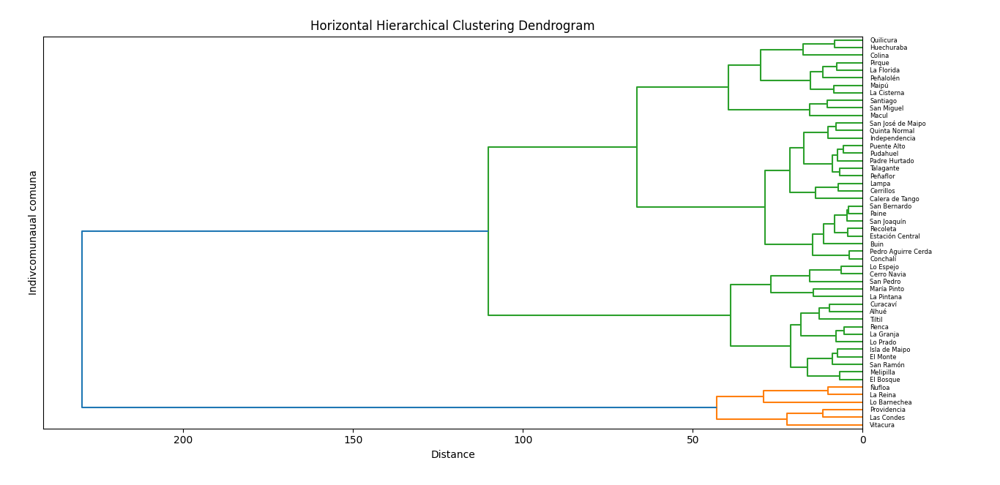

# Hierarchical cluster analysis

### Set working directory and load data
```
import os

import pandas as pd

os.chdir('directory')

df = pd.read_csv('comunas.csv')

df.info()
```
### Import libraries
```
from scipy.cluster.hierarchy import linkage, dendrogram

import matplotlib.pyplot as plt
```
### Define X data (exclude 'comuna')
```
X = df.drop('comuna', axis=1)
```
### Perform hierarchical clustering
```
Z = linkage(X, method='ward')  # Try 'average', 'complete', 'single' if needed
```
### Plot horizontal dendrogram
```
plt.figure(figsize=(8, 5))  # Adjust size as needed

dendrogram(

    Z,
    
    labels=df['comuna'].values,
    
    orientation='left',  # Makes dendrogram horizontal
    
    leaf_font_size=6,    # Adjust font size

)

plt.title('Hierarchical Cluster Analysis')

plt.xlabel('Distance')

plt.ylabel('Comuna')

plt.tight_layout()  # Prevents label cutoff

plt.show()
```


